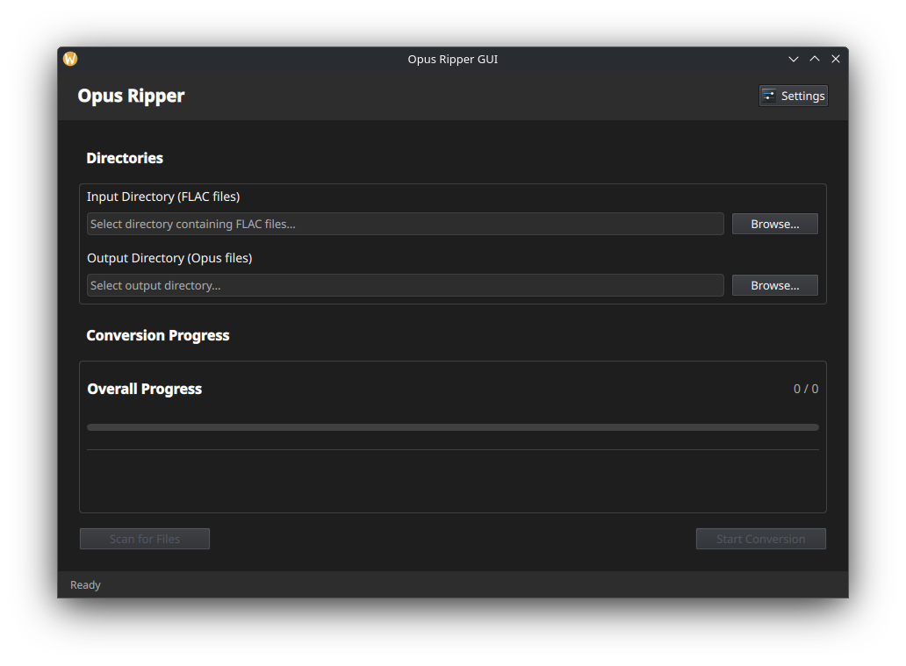

# Opus Ripper GUI

A modern Qt6/QML desktop application for batch converting FLAC audio files to Opus format with metadata preservation and directory structure retention.




## Features

- Batch conversion of FLAC files to Opus format
- Uses libopus reference implementation for best quality
- Preserves all metadata including album art
- Maintains directory structure
- Multi-threaded conversion with progress tracking
- Configurable encoding parameters (bitrate, complexity, VBR)
- Modern Qt6/QML user interface

## Dependencies

### Required Libraries
- Qt6 (>= 6.5) with Quick and Concurrent modules
- libopus (reference implementation)
- libFLAC++ (for FLAC decoding)
- TagLib (for metadata handling)
- CMake (>= 3.16)
- C++17 compiler

### Installing Dependencies

#### Ubuntu/Debian
```bash
sudo apt update
sudo apt install build-essential cmake qt6-base-dev qt6-declarative-dev \
                 libqt6quick6 libqt6quickcontrols2-6 libqt6concurrent6 \
                 libopus-dev libflac++-dev libtag1-dev pkg-config
```

#### Fedora
```bash
sudo dnf install cmake gcc-c++ qt6-qtbase-devel qt6-qtdeclarative-devel \
                 qt6-qtquickcontrols2-devel opus-devel flac-devel \
                 taglib-devel pkg-config
```

#### Arch Linux
```bash
sudo pacman -S base-devel cmake qt6-base qt6-declarative qt6-quickcontrols2 \
               opus flac taglib pkg-config
```

## Building

1. Clone the repository:
```bash
git clone <repository-url>
cd opus-ripper-gui
```

2. Create a build directory:
```bash
mkdir build
cd build
```

3. Configure with CMake:
```bash
cmake ..
```

4. Build the application:
```bash
make -j$(nproc)
```

5. Run the application:
```bash
./opus-ripper-gui
```

Or use the provided run script:
```bash
./run.sh
```

## Usage

1. **Select Input Directory**: Choose the directory containing your FLAC files
2. **Select Output Directory**: Choose where to save the converted Opus files
3. **Scan for Files**: Click "Scan for Files" to find all FLAC files recursively
4. **Configure Settings** (optional): 
   - Adjust bitrate (32-256 kbps)
   - Set encoding complexity (0-10, higher = better quality but slower)
   - Enable/disable Variable Bitrate (VBR)
   - Set number of parallel conversions
5. **Start Conversion**: Click "Start Conversion" to begin

## Development Status

This is the initial project structure with stub implementations. The following components need to be implemented:

### Core Features to Implement
1. **FLAC Decoding**: Integrate libFLAC++ for reading FLAC audio data
2. **Opus Encoding**: Implement proper Opus encoding using libopus
3. **Metadata Handling**: Complete TagLib integration for metadata preservation
4. **Progress Tracking**: Wire up real-time progress updates
5. **Error Handling**: Implement robust error handling and recovery

### Code Structure
- `src/core/`: Core audio processing components
- `src/models/`: Data models for file tracking and progress
- `src/controllers/`: Application logic and coordination
- `qml/`: User interface components

## Contributing

1. Fork the repository
2. Create a feature branch
3. Implement your changes
4. Test thoroughly
5. Submit a pull request

## Current Status

This project is in active development. The core functionality is implemented but some features are still being worked on:

- ✅ FLAC decoding
- ✅ Opus encoding using libopus reference implementation  
- ✅ Directory structure preservation
- ✅ Multi-threaded batch conversion
- ✅ Progress tracking
- ⚠️  Basic metadata copying (full Ogg Opus metadata support in progress)
- ⚠️  Simple Opus format output (proper Ogg container support in progress)
- ❌ Album art preservation (planned)

## License

This project is licensed under the MIT License - see the [LICENSE](LICENSE) file for details.

## Acknowledgments

- [Opus codec](https://opus-codec.org/) by Xiph.Org Foundation
- [Qt framework](https://www.qt.io/) by The Qt Company
- [TagLib](https://taglib.org/) audio metadata library
- [FLAC](https://xiph.org/flac/) by Xiph.Org Foundation

## Contributing

Contributions are welcome! Please feel free to submit a Pull Request.